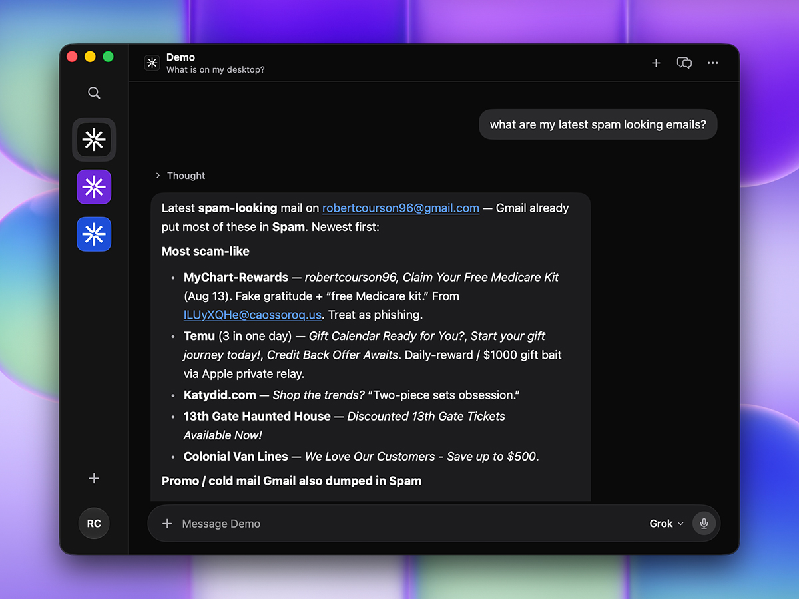
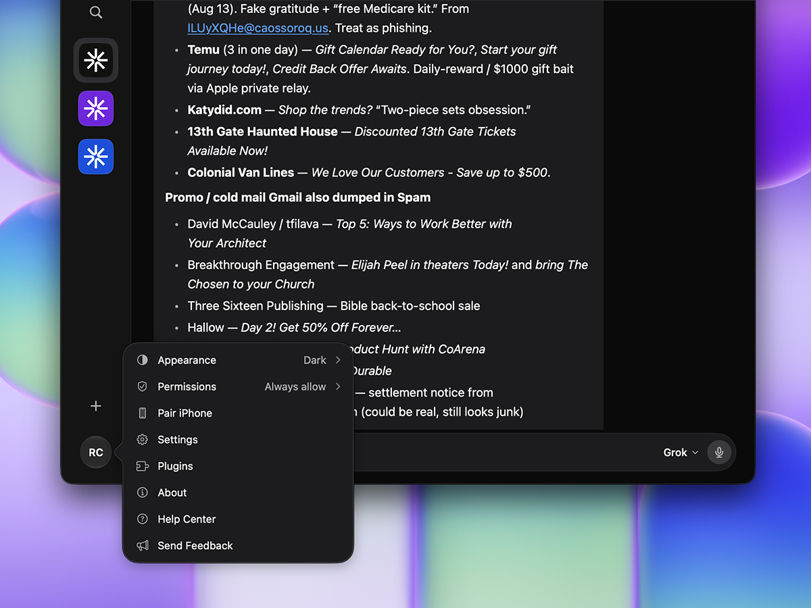
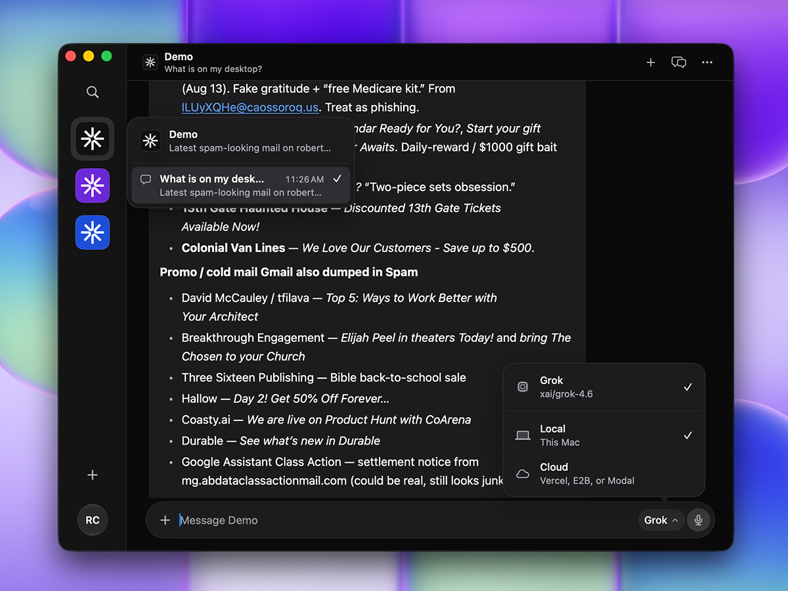

# Joyflow

A Mac teammate that lives in folders you keep.

Chat is the interface. The product is the project on disk: a `SOUL.md`, standing notes, files you attach, and a workspace the model is allowed to touch after you say yes.

[Download the Mac app](https://github.com/robzilla1738/joyflow-bot/releases/latest) · [Buy me a coffee](https://buymeacoffee.com/robcourson)

[](https://github.com/robzilla1738/joyflow-bot/actions/workflows/ci.yml)
[](LICENSE)

<p>
  
</p>
<p>
  
</p>
<p>
  
</p>

## What you get

Pick a folder (or make a new one). Talk to any [Vercel AI Gateway](https://vercel.com/docs/ai-gateway) or OpenAI-compatible model. Joyflow can read and write in that folder, run shell, move windows, and call the apps you connect through Composio. The default is **Ask every time**. A short denylist (system paths, SIP) cannot be turned off.

Projects stay on this Mac under Application Support, or in a folder you chose. There is no account. API keys live in Keychain.

The Mac app is what ships today. An **iPhone companion is coming soon** — same projects, chats that still run on the Mac.

Joyflow is independent. It is not affiliated with SpaceXAI, Cursor, Vercel, or Composio.

## Download

macOS 26 or later. Open the DMG from [Releases](https://github.com/robzilla1738/joyflow-bot/releases/latest) and drag **Joyflow** onto Applications.

Builds are Developer ID signed and notarized. Sparkle checks GitHub Releases for updates (EdDSA-signed). You can also use **Joyflow → Check for Updates…**.

On first launch, macOS may still ask for Accessibility, Files and Folders, or Full Disk Access depending on what you tell it to do. Those are system prompts, not Joyflow accounts.

In Settings → General, paste a Gateway (or any OpenAI-compatible) API key and a model id such as `openai/gpt-4.1`.

## iPhone, coming soon

A native iPhone app is in the tree and will ship as a companion, not a second brain. Pairing, off-network mailbox, and phone-to-Mac chats are built; a public iPhone build is not out yet. The notes for when it is: [docs/pair.md](docs/pair.md).

## Permissions, honestly

| Setting | What it means |
| --- | --- |
| Ask first | Every mutating tool waits on you |
| Always allow | Skip the prompt for that class of action |
| Block | Refuse it |

Ask first is the default. Always allow is a preference, not a jailbreak. `/System`, `/usr`, `/bin`, and a few other prefixes stay blocked. Full Disk Access still belongs to you in System Settings.

## Build from source

You need macOS 26+, a full **Xcode** (26+), [XcodeGen](https://github.com/yonaskolb/XcodeGen), SwiftLint, and swift-format. An iOS 18 target is in the repo for the coming iPhone companion.

```bash
git clone https://github.com/robzilla1738/joyflow-bot.git
cd joyflow-bot

# only if xcode-select is Command Line Tools:
# export DEVELOPER_DIR=/Applications/Xcode.app/Contents/Developer

scripts/test.sh
scripts/lint.sh
scripts/build.sh
scripts/build-ios.sh
open .derivedData/Build/Products/Debug/Joyflow.app
```

A local disk image (unsigned-for-you, or Release if you have Developer ID):

```bash
scripts/package-dmg.sh
open dist/Joyflow.dmg
```

The iPhone app is not a public release yet. If you are working on it: `DEVELOPMENT_TEAM=YOURTEAMID DEVICE=1 scripts/build-ios.sh`.

Signed, notarized release (needs Developer ID + a `notarytool` keychain profile):

```bash
scripts/build-release.sh
scripts/notarize.sh
SKIP_BUILD=1 APP=build/export/Joyflow.app scripts/package-dmg.sh
```

See [docs/updates.md](docs/updates.md) for Sparkle keys and the appcast.

## Layout

```
Joyflow/          Mac SwiftUI app
JoyflowiOS/       iPhone SwiftUI app (coming soon; same tokens, marks, kit)
JoyflowKit/       Engine (filesystem wiki, pair/handoff, gateway, policy, sandboxes)
docs/             Architecture, pairing, updates, screenshots
scripts/          test, lint, build, package, notarize
```

Project folders on disk are documented in [docs/layout.md](docs/layout.md). How the pieces fit: [docs/architecture.md](docs/architecture.md).

## Support

This is free, MIT-licensed software I maintain in public. If it saves you an evening, [buy me a coffee](https://buymeacoffee.com/robcourson).

Bugs and ideas go in [GitHub Issues](https://github.com/robzilla1738/joyflow-bot/issues). Do not put API keys in tickets.

## License

MIT. See [LICENSE](LICENSE).
